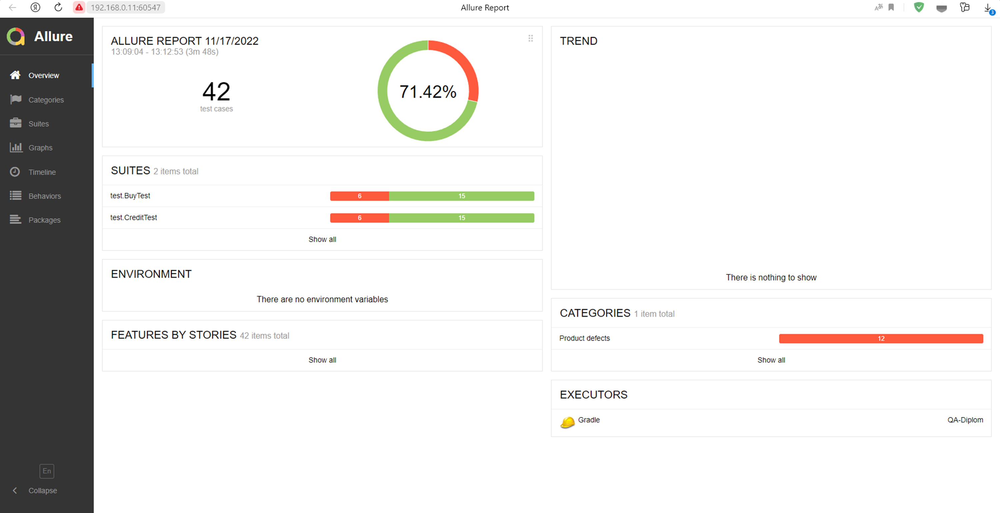
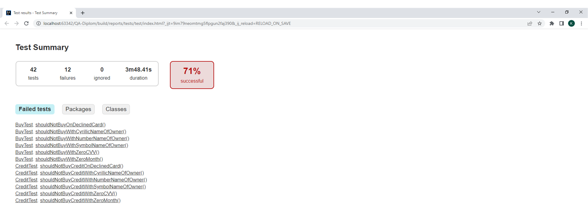
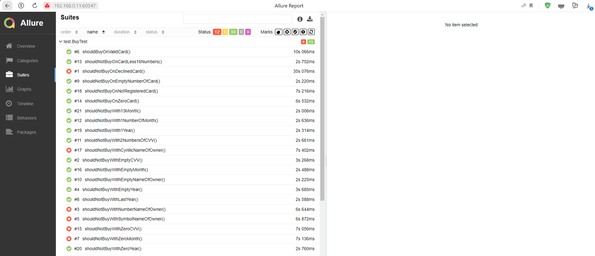
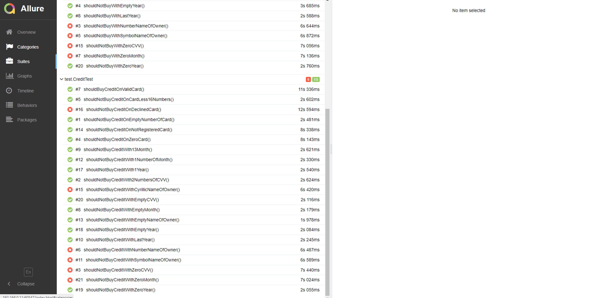

## Краткое описание
Проведено автоматизированное тестирования приложения, который предлагает купить тур по определённой цене двумя способами:
1.Обычная оплата по дебетовой карте.
2.Уникальная технология: выдача кредита по данным банковской карты.

Само приложение не обрабатывает данные по картам, а пересылает их банковским сервисам:

-сервису платежей, далее Payment Gate;
-кредитному сервису, далее Credit Gate.

Поддержка двух СУБД: MySQL, PostgreSQL.

## Количество тест-кейсов
Общее количество тест-кейсов составило 42.

## Процент успешных и неуспешных тест-кейсов
Из 42 тест-кейсов:
71% успешных тест-кейсов, т.е. 30 тест-кейсов;
29% неуспешных тест-кейсов, т.е. 12 тест-кейсов.

*Результаты прогона авто-тестов представлены в отчетах Allure (./gradlew allureServe), Gradle (./build/reports/tests/test/index.html):

## Общие рекомендации

* Исправить выявленные баги в приложении (см. Issues).

